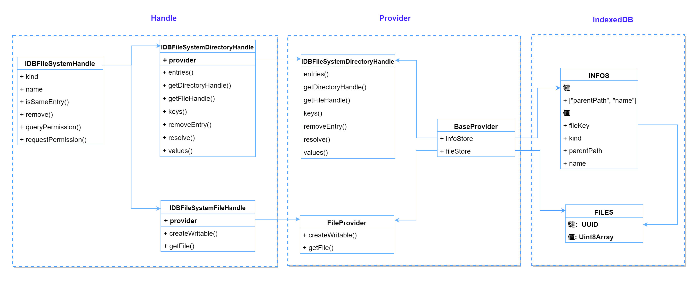

# 基于indexedDB和promise的文件系统

## 简介
基于indexedDB遵循 [File System API](https://developer.mozilla.org/en-US/docs/Web/API/File_System_API) 异步 API 实现的前端文件系统。


## 设计结构图



## 特点
* 非安全上下文也可用
* 支持多实例
* 良好的数据可观测行


## API
* File API，参见 [FileSystemHandle](https://developer.mozilla.org/en-US/docs/Web/API/FileSystemHandle)
  * [kind](https://developer.mozilla.org/en-US/docs/Web/API/FileSystemHandle/kind) 类型
  * [name](https://developer.mozilla.org/en-US/docs/Web/API/FileSystemHandle/name)  名称
  * [isSameEntry()](https://developer.mozilla.org/en-US/docs/Web/API/FileSystemHandle/isSameEntry) 是否相同
  * [remove()](https://developer.mozilla.org/en-US/docs/Web/API/FileSystemHandle/remove) 删除
  * [createWritable()](https://developer.mozilla.org/en-US/docs/Web/API/FileSystemFileHandle/createWritable) 创建可写流
  * [getFile()](https://developer.mozilla.org/en-US/docs/Web/API/FileSystemFileHandle/getFile) 获取文件

* Directory API， 参见 [FileSystemDirectoryHandle](https://developer.mozilla.org/en-US/docs/Web/API/FileSystemDirectoryHandle)
  * [kind](https://developer.mozilla.org/en-US/docs/Web/API/FileSystemHandle/kind) 类型
  * [name](https://developer.mozilla.org/en-US/docs/Web/API/FileSystemHandle/name)  名称
  * [isSameEntry()](https://developer.mozilla.org/en-US/docs/Web/API/FileSystemHandle/isSameEntry) 是否相同
  * [remove()](https://developer.mozilla.org/en-US/docs/Web/API/FileSystemHandle/remove) 删除
  * [entries()](https://developer.mozilla.org/en-US/docs/Web/API/FileSystemDirectoryHandle/entries) 键值对
  * [getDirectoryHandle()](https://developer.mozilla.org/en-US/docs/Web/API/FileSystemDirectoryHandle/getDirectoryHandle) 获取子文件夹
  * [getFileHandle()](https://developer.mozilla.org/en-US/docs/Web/API/FileSystemDirectoryHandle/getFileHandle) 获取子文件
  * [keys()](https://developer.mozilla.org/en-US/docs/Web/API/FileSystemDirectoryHandle/keys) 键
  * [removeEntry()](https://developer.mozilla.org/en-US/docs/Web/API/FileSystemDirectoryHandle/removeEntry) 删除子文件或子文件夹
  * [resolve()](https://developer.mozilla.org/en-US/docs/Web/API/FileSystemDirectoryHandle/resolve) 获取相对路径
  * [values()](https://developer.mozilla.org/en-US/docs/Web/API/FileSystemDirectoryHandle/values) 值

## 如何使用

```javascript

async function init() {

  // 获取所有实例
  const allSystems = await getAllIDBFileSystem();
  console.log("allSystems:", allSystems);

  const rootDir = await getInstance();
  const dirHandle = await rootDir.getDirectoryHandle("测试文件夹1", { create: true });
  const dirHandleL2 = await dirHandle.getDirectoryHandle("测试文件夹1的子文件夹1", {
    create: true,
  });
  const dirHandleL2_2 = await dirHandle.getDirectoryHandle("测试文件夹1的子文件夹2", {
    create: true,
  });

  const fileHandle = await rootDir.getFileHandle("测试文件1.txt", { create: true });

  const fileHandleL2_1 = await dirHandleL2.getFileHandle(
    "测试文件夹1的子文件夹1的文件.txt",
    {
      create: true,
    }
  );
  const fileHandleL2_2 = await dirHandleL2.getFileHandle(
    "测试文件夹1的子文件夹1的文件2.txt",
    { create: true }
  );

  // resolve
  dirHandle
    .resolve(fileHandle)
    .then((r) => console.log("resolve:", r))
    .catch(console.error);
  dirHandle
    .resolve(dirHandle)
    .then((r) => console.log("resolve:", r))
    .catch(console.error);
  dirHandleL2_2
    .resolve(dirHandle)
    .then((r) => console.log("resolve:", r))
    .catch(console.error);

  // 遍历
  const tempDir = dirHandle;
  for await (const [key, value] of tempDir.entries()) {
    console.log({ key, value });
  }
  for await (const key of tempDir.keys()) {
    console.log("key:", key);
  }
  for await (const v of tempDir.values()) {
    console.log("v:", v);
  }

  // isSameEntry
  fileHandle
    .isSameEntry(fileHandleL2_2)
    .then((r) => console.log("fileHandle.isSameEntry(fileHandleL2_2):", r));
  fileHandle
    .isSameEntry(fileHandle)
    .then((r) => console.log("fileHandle.isSameEntry(fileHandle):", r));

  rootDir
    .isSameEntry(dirHandle)
    .then((r) => console.log("rootDir.isSameEntry(dirHandle):", r));
  dirHandle
    .isSameEntry(dirHandle)
    .then((r) => console.log("dirHandle.isSameEntry(dirHandle):", r));

  // createWritable
  const contents =
    "我们都是好孩子我们都是好孩子我们都是好孩子我们都是好孩子我们都是好孩子我们都是好孩子我们都是好孩子我们都是好孩子";
  const writable = await fileHandleL2_1.createWritable();
  // Write the contents of the file to the stream.
  await writable.write(contents);
  // Close the file and write the contents to disk.
  await writable.close();

  // getFile
  fileHandleL2_1.getFile().then((r) => console.log("fileHandle file:", r));
  fileHandleL2_2.getFile().then((r) => console.log("fileHandleL2_2 file:", r));

  // 文件删除
  fileHandleL2_1.remove();
  fileHandleL2_2.remove();

  // 目录删除文件
  dirHandleL2.removeEntry("测试文件夹1的子文件夹1的文件.txt");
  dirHandleL2.removeEntry("测试文件夹1的子文件夹1的文件2.txt")

  // 目录删除
  dirHandleL2.remove({
    recursive: true
  })

  rootDir.remove({ recursive: true })
}
```


## TODO::
* [x] 分离基础数据和二进制文件  (2025-04-21)
* [x] 改进基础数据存储，方便查询 (2025-04-22)
* [ ] 改进 entries(), values(), keys() 真游标？(??暂可不改进，因为查询的改进)