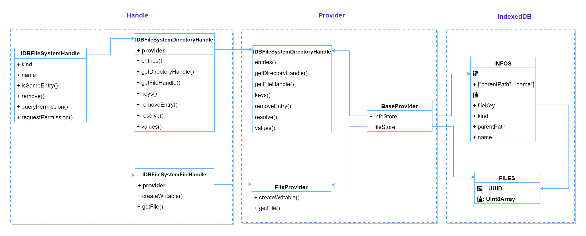

## 设计

### 设计图

### 存储
*  一个ObjectStore存基本信息，另外一个存Blob
*  存储Blob的ObjectStore的key是 uuid，通过uuid关联，这样文件重命名的时候，不涉及Blob的转存。
*  基本信息ObjectStore的键，`_{Level}_/测试文件夹1/测试文件`, `Level`表示层级，这样提高搜索效率。？？不得行啊，查询某个子目录不行。
  

### API 
参考 [File System API](https://developer.mozilla.org/en-US/docs/Web/API/File_System_API), 核心实现

- [x] FileSystemHandle
  - [x] kind
  - [x] name
  - [x] isSameEntry()
  - [x] remove()
  - [x] queryPermission()
  - [x] requestPermission()
- [x] FileSystemFileHandle
  - [ ] createSyncAccessHandle() （Worker使用的同步API, 不实现）
  - [x] createWritable()         （非标准参数 mode未实现）
  - [x] getFile()
- [x]  FileSystemDirectoryHandle
  - [x] entries()
  - [x] getDirectoryHandle()
  - [x] getFileHandle()
  - [x] keys()
  - [x] removeEntry()
  - [x] resolve()
  - [x] values()
